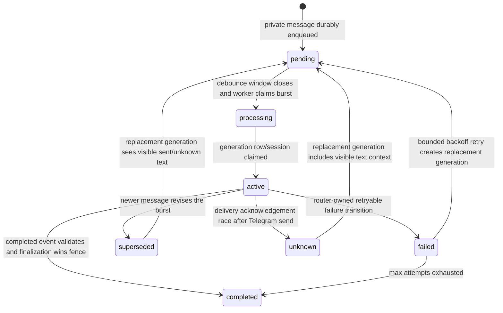

# Railway and Daytona operations

This is the production runbook for the `tomo_core` Railway service. Railway runs the control API and the one shared Telegram listener. In `daytona` mode, it also owns Daytona provisioning and SuperGrok token refresh; Daytona sandboxes execute one user turn at a time.

Set the Railway service root to `tomo_core/`. Its committed `railway.toml` starts `uv run python scripts/railway_core_start.py`, exposes `/v1/health`, and uses Railway's `$PORT`. Mount a Railway volume at `/data`.

## Railway variables

Set these variables on the core service. Values marked required are required for the stated runtime.

| Variable | Required | Value and default |
| --- | --- | --- |
| `TOMO_HOSTED_RUNTIME` | yes | `local` or `daytona`. Set it explicitly. If omitted, the code infers `daytona` only when Railway reports a production environment; otherwise it fails unless static response mode is in use. |
| `TOMO_CORE_DATA_DIR` | yes | `/data`. The startup wrapper otherwise uses `TOMO_DATA_DIR`, then `/data` when it exists, then `.tomo_core`; hosted configuration requires a writable value. |
| `TOMO_TELEGRAM_GLOBAL_BOT_TOKEN` | yes for bot | BotFather token for the one shared bot. Do not use the legacy `TELEGRAM_BOT_TOKEN` hosted path. |
| `TOMO_TELEGRAM_GLOBAL_BOT_USERNAME` | recommended | Bot username without `@`; needed by the dashboard when it creates Telegram deep links. |
| `TOMO_CONTROL_API_KEY` | dashboard/control integration | Shared dashboard-to-control API secret. |
| `TOMO_CONTROL_HOST` | no | Defaults to `0.0.0.0` in the Railway wrapper. |
| `TOMO_CONTROL_PORT` | no | Defaults to Railway `$PORT`, or `8787` if `PORT` is absent. |
| `TOMO_TELEGRAM_POLL_TIMEOUT` | no | Long-poll seconds, default `30`; valid range is `1..60`. |
| `TOMO_TELEGRAM_INPUT_DEBOUNCE_SECONDS` | no | Resettable quiet window for coalescing normal Telegram text into one input burst, default `0.7`; must be non-negative. |
| `TOMO_TELEGRAM_DELIVERY_PACE_SECONDS` | no | Minimum pause between progressive Telegram bubbles, default `1.5`; must be non-negative. |
| `TOMO_ROUTER_WORKERS` | no | Durable inbox worker count, default `4`; valid range is `1..32`. |
| `TOMO_XAI_MODEL` | no | Model used for hosted Daytona sandbox turns and local model providers, default `grok-4.5`. Changes are included in the sandbox environment on the next turn. |
| `TOMO_XAI_REASONING_EFFORT` | no | Reasoning effort passed to SuperGrok/xAI chat completions in hosted Daytona sandboxes, default `high`. Changes are included in the sandbox environment on the next turn. |
| `DAYTONA_API_KEY` | `daytona` | Daytona API credential. |
| `TOMO_DAYTONA_SNAPSHOT` | `daytona` | Active, immutable Daytona snapshot name. |
| `TOMO_DAYTONA_SANDBOX_DATA_DIR` | `daytona` | Absolute POSIX path for the mounted per-user volume, normally `/var/lib/tomo`. |
| `TOMO_SUPERGROK_OAUTH_JSON_B64` | `daytona` | Base64-encoded JSON exported from a Grok CLI login. Railway refreshes and stores its working copy on `/data`. |
| `XAI_API_KEY` | `local`, optional | Direct model API key for local-mode replies. Not used by Daytona sandboxes. |
| `TOMO_CORE_STATIC_RESPONSE` | local smoke only | Fixed reply. Its presence permits inferred `local` mode outside production; do not use it for real hosted traffic. |

`daytona` requires every Daytona and SuperGrok variable above. `local` runs each user's runtime in the Railway process and needs neither `DAYTONA_API_KEY`, snapshot, sandbox path, nor bootstrap OAuth JSON.

## Bootstrap SuperGrok on Railway

On a trusted operator machine, sign in with the Grok CLI first. Export exactly the file used by the hosted broker:

```bash
cd tomo_core
uv run python scripts/export_grok_auth.py ~/.grok/auth.json
```

Set the command's single-line output as the Railway value of `TOMO_SUPERGROK_OAUTH_JSON_B64`; do not put the JSON, access token, or refresh token in a command line, log, dashboard field, or source file. The broker writes its mutable refreshed copy to `/data/hosted-auth/supergrok.json`, atomically and mode `0600` where supported. When the Railway variable changes, the broker detects its fingerprint and replaces that local copy on the next token use.

## Build and roll snapshots

Build an immutable name for every image change from `tomo_core/`:

```bash
cd tomo_core
uv run python scripts/create_daytona_snapshot.py --name tomo-core-20260710-1
```

The script builds `Dockerfile.daytona` and succeeds only when Daytona reports `active`. Put that exact name in `TOMO_DAYTONA_SNAPSHOT`, then redeploy Railway. On a user's next setup or message, reconciliation deletes that user's sandbox if its recorded or reported snapshot differs and creates a replacement with the existing named volume mounted at `TOMO_DAYTONA_SANDBOX_DATA_DIR`.

The first rollout of model environment support requires a snapshot containing that code. After every sandbox is on such a snapshot, changing only `TOMO_XAI_MODEL` or `TOMO_XAI_REASONING_EFFORT` requires a Railway redeploy but no new Daytona snapshot; the new values are passed on each turn.

Never reuse a name for changed content. If an accidental name must be rebuilt, the explicit destructive command is:

```bash
cd tomo_core
uv run python scripts/create_daytona_snapshot.py --name tomo-core-20260710-1 --replace
```

Update `TOMO_DAYTONA_SNAPSHOT` and redeploy immediately after replacement. Do not replace a snapshot still named by the running production service: a sandbox on the old image can otherwise look current by name.

## Delivery and persistence

The listener long-polls only private Telegram updates. It inserts each update into `/data/onboarding.sqlite` before advancing its Telegram offset. `update_id` is unique, workers preserve order per chat, and an interrupted `processing` row returns to `pending` at listener startup.

Normal text messages for one chat are coalesced into an ordered burst after the resettable debounce window. A later normal message during generation increments the burst revision, marks the older generation `superseded`, and schedules best-effort Daytona process-session deletion. Railway still fences every send and finalization in SQLite, so hard cancellation is an optimization, not the correctness boundary.

Sandbox output uses protocol v2 event lines: `TOMO_SANDBOX_EVENT=...` with ordered `utterance`, `completed`, or typed `error` events. Railway validates request ID, generation ID, sequence continuity, and event shape before delivery. The sandbox receives no Telegram token or destination chat ID; Railway is the only Telegram sender.

Delivery is duplicate-averse rather than exactly-once. Before each bubble, Railway reserves `(generation_id, revision, sequence)` in SQLite, checks that the generation remains active, sends to the trusted installation chat, and records Telegram's returned message ID. If Telegram may have accepted a send but local acknowledgement fails, the event becomes `unknown` and is not blindly resent; replacement generations include sent or unknown visible text as context.

Retryable control-update failures back off at 1, 2, 4, 8, and 16 seconds; after the fifth attempt, the update is marked complete to avoid blocking later control updates in that chat.

### Generation state diagram



Only `TelegramUpdateRouter.process_next` moves a claimed generation from `active` to failed/retry on retryable errors. Gateway and dispatch code raise typed safe failures and leave the bounded failure/backoff transition to the router, so missing or rebound installations cannot make a claimed generation look successfully processed.

The same Railway volume also holds installations, the sandbox registry, and the broker's refreshed auth. Each `tomo_id` maps deterministically to one Daytona sandbox name and one volume name. A durable checkpoint prefix/volume may have exactly one active sandbox/local working copy. Reconciliation must delete or stop the old sandbox before attaching its volume to a replacement; if deletion fails, it must not create a parallel writer. Reconciliation creates a missing volume, resumes a stopped sandbox, replaces invalid or snapshot-mismatched sandboxes, smoke-tests new/resumed sandboxes, and keeps the volume when replacing a sandbox. Sandboxes have Daytona auto-stop disabled. This is an operational ownership rule, not a distributed lock on the incompatible durable volume.

Personal-data mutations commit locally and synchronously checkpoint before reporting success. If checkpointing fails, the operation reports a storage failure even though the local working copy can be ahead of durable state. Preserve and restart that same sandbox, or reconcile from the latest valid checkpoint; never blindly create a parallel writer for the durable prefix/volume.

## Logs and safe recovery

Use Railway deployment and service logs for the supervised control API and shared listener. Successful startup prints `starting control api and shared telegram listener.` and the listener prints `shared telegram gateway polling started.` The service health endpoint is `/v1/health`. Do not run a second long-poller with the production bot token.

For a non-Railway background listener, `telegram-shared start --background` writes `<TOMO_CORE_DATA_DIR>/telegram_shared.log` and `telegram_shared.pid`; Railway uses the foreground supervised listener instead.

| Symptom | Safe action |
| --- | --- |
| Stuck provisioning or `sandbox_*`/`volume_*` failure | Check Railway and Daytona status, correct the credential, snapshot, or Daytona outage, then redeploy or have the user send another message. The retained installation and registry are reconciled on the next attempt. Do not delete the user's volume unless intentionally discarding their runtime data. |
| SuperGrok refresh failure | On a trusted machine run the export command above after `grok login`, replace `TOMO_SUPERGROK_OAUTH_JSON_B64`, and redeploy. This safely resets Railway's cached broker payload on next use. |
| Snapshot mismatch | Build a new immutable snapshot, update `TOMO_DAYTONA_SNAPSHOT`, and redeploy. Next reconciliation replaces the sandbox while retaining its volume. |
| Listener stopped or stale local PID | Redeploy Railway. For a local background listener only: `uv run tomo-core telegram-shared restart --data-dir <data-dir>`. This stops a live PID or removes a stale PID before starting one listener. |

## Snapshot rollout verification

Before changing `TOMO_DAYTONA_SNAPSHOT`:

1. Build the new immutable snapshot from `tomo_core/` and confirm `scripts/create_daytona_snapshot.py` reports the snapshot as `active`.
2. Run the affected local tests with `PYTHONDONTWRITEBYTECODE=1` and the same `UV_PROJECT_ENVIRONMENT` used by the hosted implementation venv.
3. Confirm the current Railway service variables include the expected `TOMO_HOSTED_RUNTIME=daytona`, writable `TOMO_CORE_DATA_DIR`, bot token, Daytona API key, snapshot name, sandbox data dir, and SuperGrok bootstrap payload. Check names only; do not copy secret values into logs.
4. Confirm no Daytona SDK API migration is being attempted unless the installed SDK evidence requires it.

After Railway redeploys with the new snapshot:

1. Check `/v1/health` and Railway logs for `starting control api and shared telegram listener.` and `shared telegram gateway polling started.`
2. Send a private Telegram message from a bound chat and verify the update is acknowledged only after the durable inbox accepts it.
3. Confirm reconciliation replaces any sandbox whose recorded or reported snapshot differs, while retaining the user's volume.
4. Verify a normal text burst produces ordered v2 sandbox events, delivery reservations, Telegram sends to the trusted installation chat only, and a completed generation row.
5. Verify a superseding message marks the older generation stale and that no further local provider calls or sandbox delivery occurs after the SQLite active-generation fence fails.
6. Verify sandbox inbound JSON does not contain Telegram bot credentials, refresh tokens, `chat_id`, or `delivery_chat_id`; Railway remains the only Telegram sender.

## Security boundary

Railway alone receives and retains `TOMO_TELEGRAM_GLOBAL_BOT_TOKEN`, `DAYTONA_API_KEY`, optional `XAI_API_KEY`, and the SuperGrok bootstrap JSON/refresh token. The sandbox execution environment receives only `TOMO_INBOUND_JSON`, `TOMO_CORE_DATA_DIR`, `TOMO_INSTANCE_ID`, `TOMO_CORE_SOUL`, `TOMO_XAI_MODEL`, `TOMO_XAI_REASONING_EFFORT`, and the current `TOMO_SUPERGROK_ACCESS_TOKEN` for that one command. Sandboxes receive no Telegram credentials, API keys, bootstrap JSON, or refresh token. Treat Railway volume backups and service-variable access as credential-sensitive.
